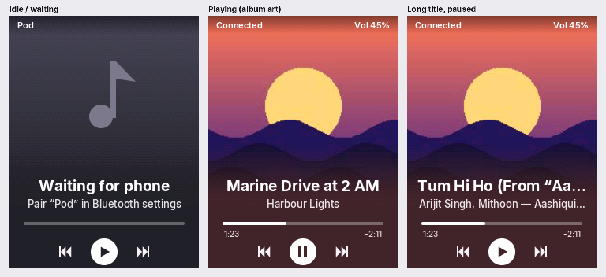
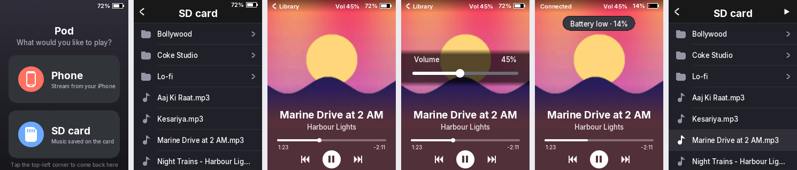

# iPOD — a DIY handheld music player

> A pocket-sized modern iPod built from scratch: Raspberry Pi Pico 2 W, Bluetooth streaming, hi-fi I2S DAC, and a touchscreen that shows album art.

A pocket-sized "modern iPod" built around the Raspberry Pi Pico 2 W. Pod receives audio from a phone over Bluetooth, plays it through a hi-fi I2S DAC, and shows album art on a touchscreen.

**Status:** breadboard prototyping. A custom PCB comes after full testing and optimisation on the breadboard.

## Goals

- **Bluetooth A2DP sink (core requirement):** phone → Pico 2 W → DAC → headphones
- **Now Playing screen** with full-bleed album art fading into an accent colour, and centred track text ("Poster" layout)
- **SD card playback** with a library browser, and a battery gauge with low-battery warning

## Hardware

| Part | Role |
|---|---|
| Raspberry Pi Pico 2 W | Main controller, Bluetooth Classic |
| Adafruit PCM5102 I2S DAC | Audio output |
| 2.8" 240×320 SPI touch display | UI and album art |
| microSD slot (on the display module) | Local playback |

The Pico 2 W replaced an earlier ESP32-S3 plan because the ESP32-S3 has no Bluetooth Classic, which A2DP needs.

## Wiring

### Display + touch (shared SPI0)

| Display pin | Pico 2 W |
|---|---|
| VCC | 3V3 (pin 36) |
| GND | GND |
| CS | GP17 |
| RESET | GP21 |
| DC | GP16 |
| SDI (MOSI) + T_DIN | GP19 |
| SCK + T_CLK | GP18 |
| LED | GP13 |
| SDO (MISO) | not connected |
| T_CS | GP22 |
| T_DO | GP20 |
| T_IRQ | GP26 |

Touch calibration (this board): both axes are reversed. Raw X ≈ 3540 at the left edge and ≈ 565 at the right; raw Y ≈ 3680 at the top and ≈ 380 at the bottom.

### PCM5102 DAC (I2S)

| DAC pin | Pico 2 W |
|---|---|
| VIN | 3V3 (pin 36) |
| GND | GND (pin 13) |
| DIN | GP9 |
| BCK | GP10 |
| WSEL (LRCK) | GP11 |
| MCK, DE, FIL, MU, FM | not connected |

### microSD (slot on the display module)

SD_CS → GP7; shares GP18 (SCK), GP19 (MOSI) and GP20 (MISO) with the display bus.

### Battery fuel gauge (optional on the breadboard)

MAX17048: SDA → GP4, SCL → GP5.

## Firmware overview

Pod has two firmware tracks:

- **`sdk/` — the main firmware** (C, Raspberry Pi Pico SDK + BTstack). A home screen picks the source:
  - **Phone:** Bluetooth audio from the iPhone with **album art over AVRCP Cover Art**, volume slider synced with the phone, press-and-hold seeking.
  - **SD card:** MP3/WAV player with a touch library browser, tags and cover art, drag-to-seek, auto-advance through a folder.
  - Poster Now Playing screen rendered on the second core, battery icon with low-battery warning.
  See [sdk/README.md](sdk/README.md) for the test plan.
- **`firmware/` — Arduino bring-up sketches** used to test each part of the hardware on its own (LED, DAC, Bluetooth, screen, touch).





## Building the firmware

The **Build SDK firmware** action compiles `sdk/` and publishes the `pod-sdk-firmware` artifact. The Arduino sketches are built by the **Build firmware** action as described below.

### Arduino sketches

Sketches live in `firmware/<name>/<name>.ino`. Every push that touches `firmware/` triggers the **Build firmware** GitHub Action, which compiles each sketch for the Pico 2 W with `arduino-cli` and the [arduino-pico](https://github.com/earlephilhower/arduino-pico) core. A `sketch.yaml` in a sketch folder can set its own board options (e.g. Bluetooth on), `firmware/libraries.txt` lists the Arduino libraries the build installs, and Pod's own libraries live in `firmware/libraries/` (e.g. `PodTouch`, the touch driver).

To flash: open the latest run under **Actions**, download the **pod-firmware** artifact, hold BOOTSEL while plugging in the Pico, and drag the `.uf2` onto the RP2350 drive.

| Sketch | What it does |
|---|---|
| `blink` | Blinks the onboard LED (build + flash check) |
| `tone_test` | 440 Hz tone through the DAC (I2S wiring check) |
| `bt_sink` | Bluetooth A2DP receiver named "Pod": phone → DAC → headphones |
| `display_test` | Colour test, title screen and touch dots on the ILI9341 + XPT2046 |
| `now_playing` | Bluetooth audio + Now Playing screen: track, artist, album and touch controls |

## Repository layout

```
sdk/        main firmware (Pico SDK, C)
firmware/   Arduino bring-up sketches (one folder per sketch)
.github/    GitHub Actions build
hardware/   schematics, wiring photos, later the PCB
docs/       notes and datasheets
PROGRESS.md dated build log
```

## PCB, battery and enclosure

The plan for the compact board (RP2350 + RM2 radio, 2.0" capacitive IPS screen, USB-C charging, LiPo with fuel gauge, 3D-printed case) is in [docs/pcb-plan.md](docs/pcb-plan.md).

## Progress

See [PROGRESS.md](PROGRESS.md).
