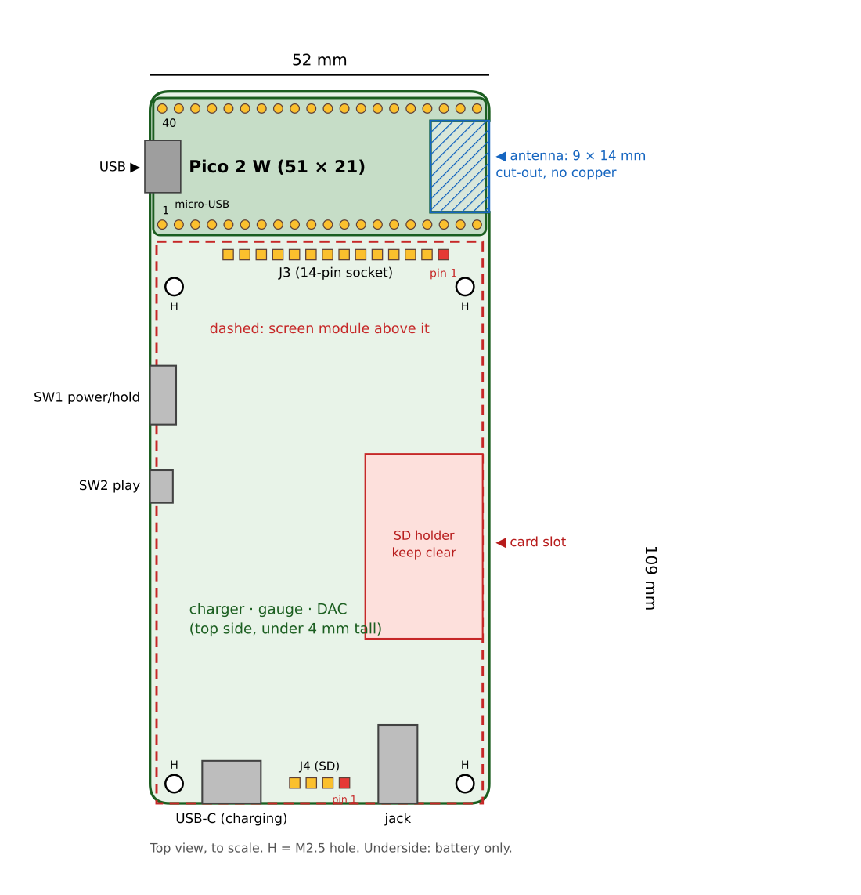

# Pod — PCB Rev A design spec

The design for the first Pod board. One section per schematic page, with every connection written
out. It's drawn in **EasyEDA Pro**; `docs/easyeda-guide.md` explains how, click by click.

**Change on 7 Oct 2026 (evening):** the board now carries Ash's own **Raspberry Pi Pico 2 W**,
soldered on, instead of a bare RP2350A chip and RM2 radio. This removes the chip, flash, PSRAM,
crystal, radio and 3.3 V regulator from our board (the Pico has all of them), drops the radio page,
and makes a 2-layer board enough. The KiCad skeleton in `hardware/pod-pcb/` was for the old
version and is no longer used.

## Decisions

| # | Decision | Choice |
|---|---|---|
| 1 | Main board | **Raspberry Pi Pico 2 W module**, soldered onto our PCB (through its pin headers or castellated edge) |
| 2 | Screen | **Keep the 2.8" 240×320 resistive module** (ILI9341 + XPT2046 + microSD slot) |
| 3 | Screen mounting | **The red module plugs into sockets on our PCB** |
| 4 | Battery | **1000 mAh single-cell LiPo, ~5 mm thick** (503450, with protection board), **on the underside of our board** |
| 5 | Controls | **Play/pause + wake button** and an **iPod-style power/hold slide switch** |
| 6 | Ports | **USB-C for charging** (bottom edge); the **Pico's micro-USB for programming** (left side, top) |

On our board: USB-C charging socket, BQ24074 charger with power path, MAX17048 fuel gauge, power
switch, PCM5102A DAC and headphone jack, the sockets for the screen module, and the play button.

**Size:** board **52 × 109 mm**, Pod about **57 × 115 × 24 mm**. The Pico sits in a 23 mm strip
at the top, beyond the screen module, so its antenna isn't covered (see Layout).

## Firmware compatibility

The Pico uses exactly the breadboard pins, so `pod.uf2` runs on the board unchanged. New on the
board: charger status pins, the button, headphone detect and a DAC mute pin. The firmware gets
small additions for these after bring-up.

## How the power works

- **USB-C** → `VBUS` → BQ24074 charger → `VSYS` → the Pico's **VSYS** pin. The charger runs the Pod
  from USB and charges the battery at the same time; without USB it runs it from the battery.
- The Pico's own regulator makes **3.3 V** from VSYS. Its **3V3** pin powers the screen, DAC and
  fuel gauge. Keep the total 3V3 load under **300 mA** (the screen backlight is the largest at
  about 80 mA, so there's plenty of margin).
- **SW1** pulls the Pico's **3V3_EN** pin to GND for *off*: the Pico, screen and DAC lose power;
  the charger still charges. The off-state drain is about 0.07 mA (over a year on a full charge).
- The Pico's **VBUS** pin is joined to our `VBUS`, so the micro-USB cable can charge too.
  **Plug in only one cable at a time.**

---

## Parts list (Rev A)

Prefer JLCPCB **Basic** parts for resistors and capacitors (cheaper assembly).

| Ref | Part | MPN (example) | Package | Notes |
|---|---|---|---|---|
| U1 | **Raspberry Pi Pico 2 W** | — (Ash's own) | 51 × 21 mm module | hand-soldered through its pin headers; drawn as two 1×20 2.54 mm TH headers **J6** (Pico pins 1–20) and **J7** (pins 21–40, J7 pin n = Pico pin 20 + n), not in the BOM |
| U2 | Charger + power path | BQ24074RGTR | VQFN-16 3×3 | |
| U3 | Fuel gauge | MAX17048G+T10 | TDFN-8 2×2 | firmware already supports it |
| U8 | Audio DAC | PCM5102APWR | TSSOP-20 | |
| J1 | USB-C socket (charging) | HRO TYPE-C-31-M-12 | 16-pin SMD | |
| J2 | Battery connector | JST S2B-PH-SM4-TB | PH 2.0 mm | **check your battery's polarity** |
| J3 | Screen socket | 1×14 female header, 2.54 mm, 8.5 mm tall | THT | module's main pins |
| J4 | SD socket | 1×4 female header, 2.54 mm, 8.5 mm tall | THT | module's SD pins |
| J5 | Headphone jack | CUI **SJ-43515TS-SMT-TR** (LCSC C5353507) | SMD, 4-pole + tip switch | pin 1 sleeve, 2 tip, 3 ring 1, 4 ring 2, 5 tip switch |
| SW1 | Power/hold switch | MSK-12C02 | SPDT side slide | |
| SW2 | Play/pause/wake | side-push SMD tactile | SMD | on the board edge |
| FB1 | Ferrite bead | 600 Ω @ 100 MHz | 0603 | DAC analog supply |
| — | Resistors, capacitors | values per page below | 0402 (bulk caps 0603/0805) | |
| BT1 | Battery | 1000 mAh LiPo, 503450, protection PCB, JST-PH lead | | off-board |

---

## Sheet 1 — Power

**Nets:** `VBUS` (USB 5 V), `VSYS` (charger output, 3.6–4.4 V, to the Pico), `VBAT` (cell),
`3V3` (from the Pico), `3V3_EN`, `GND`.

**J1 USB-C (charging only)**
- VBUS pins (A4, A9, B4, B9) → `VBUS`. GND pins (A1, A12, B1, B12) and shell → `GND`.
- CC1 (A5) → **5.1 kΩ** → GND. CC2 (B5) → **5.1 kΩ** → GND. *(Without these, USB-C chargers give 0 V.)*
- D+ (A6, B6), D− (A7, B7), SBU1, SBU2 → not connected. *(Data goes through the Pico's micro-USB.)*

**U2 BQ24074 (charger with power path)**
- IN → `VBUS`, with **4.7 µF** to GND.
- Both OUT pins → `VSYS`, with **10 µF** to GND.
- Both BAT pins → `VBAT`, with **10 µF** to GND.
- ISET → **1.8 kΩ** → GND → charge current = 890 / 1800 ≈ **0.49 A**.
- ILIM → **1.2 kΩ** → GND → input limit = 1610 / 1200 ≈ **1.34 A** (1.0 kΩ would exceed the 1.5 A maximum).
- ITERM → **3.0 kΩ** → GND → charging ends at 0.03 × 3000 / 1800 ≈ **50 mA**.
- TS → **10 kΩ** → GND.
- EN2 → `VBUS`, EN1 → GND (input limit set by ILIM). CE → GND. SYSOFF → GND. TMR → not connected.
- CHG (low = charging) → `CHG_N` → GP28, **100 kΩ** to `3V3`.
- PGOOD (low = USB present) → `PGOOD_N` → GP27, **100 kΩ** to `3V3`.
- VSS and exposed pad → GND.

**J2 battery** — pin 1 → `VBAT`, pin 2 → `GND`, mounting tabs → GND. Check the cell's polarity first.

**U3 MAX17048 (fuel gauge)**
- VDD → `VBAT` with **1 µF** to GND. CELL → `VBAT`. GND, CTG, QSTRT, exposed pad → GND.
- SDA → `I2C_SDA` (GP4), SCL → `I2C_SCL` (GP5); **4.7 kΩ** pull-ups to `3V3`.
- ALRT → `GAUGE_ALRT_N` → GP2, **10 kΩ** to `3V3`.

**SW1 power/hold switch (SPDT)** — middle (common) → `3V3_EN`; one side → `GND` (off); other side →
not connected (on: the Pico's own 100 kΩ pull-up holds 3V3_EN high).

*(No 3.3 V regulator and no USB ESD chip any more: the Pico has both.)*

## Sheet 2 — Pico 2 W

Every Pico pin, by its number on the Pico (pin 1 is next to the USB connector):

| Pin | Pico | Net | | Pin | Pico | Net |
|---|---|---|---|---|---|---|
| 1 | GP0 | not connected | | 21 | GP16 | `LCD_DC` |
| 2 | GP1 | `HP_DET` | | 22 | GP17 | `LCD_CS` |
| 3 | GND | `GND` | | 23 | GND | `GND` |
| 4 | GP2 | `GAUGE_ALRT_N` | | 24 | GP18 | `SPI0_SCK` |
| 5 | GP3 | not connected | | 25 | GP19 | `SPI0_MOSI` |
| 6 | GP4 | `I2C_SDA` | | 26 | GP20 | `SPI0_MISO` |
| 7 | GP5 | `I2C_SCL` | | 27 | GP21 | `LCD_RST` |
| 8 | GND | `GND` | | 28 | GND | `GND` |
| 9 | GP6 | `BTN_PLAY_N` | | 29 | GP22 | `TOUCH_CS` |
| 10 | GP7 | `SD_CS` | | 30 | RUN | not connected |
| 11 | GP8 | not connected | | 31 | GP26 | `TOUCH_IRQ` |
| 12 | GP9 | `I2S_DIN` | | 32 | GP27 | `PGOOD_N` |
| 13 | GND | `GND` | | 33 | AGND | `GND` |
| 14 | GP10 | `I2S_BCK` | | 34 | GP28 | `CHG_N` |
| 15 | GP11 | `I2S_LRCK` | | 35 | ADC_VREF | not connected |
| 16 | GP12 | `DAC_XSMT` | | 36 | 3V3 (out) | `3V3` |
| 17 | GP13 | `LCD_LED` | | 37 | 3V3_EN | `3V3_EN` |
| 18 | GND | `GND` | | 38 | GND | `GND` |
| 19 | GP14 | not connected | | 39 | VSYS | `VSYS` |
| 20 | GP15 | not connected | | 40 | VBUS | `VBUS` |

The 3 debug pins (SWCLK, GND, SWDIO) at the antenna end: not connected; they sit over the antenna
cut-out. Add **10 µF** from `3V3` to GND near pin 36 for the screen's backlight current.

## Sheet 3 — Audio (PCM5102A + jack)

- Pin 1 CPVDD → `3V3`, 100 nF + 10 µF. Pin 3 CPGND → GND.
- Pins 2 CAPP / 4 CAPM: **2.2 µF** between them. Pin 5 VNEG → **2.2 µF** to GND.
- Pin 8 AVDD → FB1 ferrite from `3V3`, then 10 µF + 100 nF to GND. Pin 9 AGND → GND.
- Pin 20 DVDD → `3V3`, 100 nF + 10 µF. Pin 19 DGND → GND. Pin 18 LDOO → **1 µF** to GND.
- Pin 12 SCK → GND (internal PLL makes the master clock from BCK, as on the breadboard).
- Pin 13 BCK ← `I2S_BCK` (GP10). Pin 14 DIN ← `I2S_DIN` (GP9). Pin 15 LRCK ← `I2S_LRCK` (GP11).
- Pins 10 DEMP, 11 FLT, 16 FMT → GND.
- Pin 17 XSMT ← `DAC_XSMT` (GP12), R21 **10 kΩ** to GND, so the DAC is muted until the firmware unmutes
  it. This removes the pop at power-on and between tracks.
- Pin 6 OUTL → R22 **470 Ω** → `HP_L` (jack tip), **2.2 nF** from `HP_L` to GND. Pin 7 OUTR → R23 **470 Ω** → `HP_R` (jack ring 1), **2.2 nF** from `HP_R` to GND.
- **J5 jack (SJ-43515TS):** pin 1 sleeve → GND; pin 4 ring 2 → GND (a normal 3-pole headphone plug's sleeve touches both); pin 2 tip → `HP_L`; pin 3 ring 1 → `HP_R`; pin 5 tip switch → R24 **4.7 kΩ** → `HP_DET` (GP1, internal pull-up).
- *How detect works:* with no plug, the tip switch rests on the tip, so GP1 reads low through the DAC output. A plug pushes it open and GP1 reads high. The 4.7 kΩ limits current into GP1 when the music swings below 0 V. Firmware: keep the DAC muted (XSMT low) unless headphones are in.
- The PCM5102A is a line-level output; it drives earbuds at modest volume. If it's too quiet once
  built, a TPA6132A2 headphone amp can go between the DAC and the jack on Rev B.

## Sheet 4 — Screen sockets and controls

**J3 1×14 socket for the red module** (pin order as printed on the module, left to right):

| J3 pin | Module | Net |
|---|---|---|
| 1 | VCC | `3V3` |
| 2 | GND | `GND` |
| 3 | CS | `LCD_CS` (GP17) |
| 4 | RESET | `LCD_RST` (GP21) |
| 5 | DC | `LCD_DC` (GP16) |
| 6 | SDI (MOSI) | `SPI0_MOSI` (GP19) |
| 7 | SCK | `SPI0_SCK` (GP18) |
| 8 | LED | `LCD_LED` (GP13) |
| 9 | SDO (MISO) | **not connected** (the screen doesn't release the line) |
| 10 | T_CLK | `SPI0_SCK` |
| 11 | T_CS | `TOUCH_CS` (GP22) |
| 12 | T_DIN | `SPI0_MOSI` |
| 13 | T_DO | `SPI0_MISO` (GP20) |
| 14 | T_IRQ | `TOUCH_IRQ` (GP26) |

**J4 1×4 socket for the module's SD pins** — SD_CS → `SD_CS` (GP7), SD_MOSI → `SPI0_MOSI`,
SD_MISO → `SPI0_MISO`, SD_SCK → `SPI0_SCK`. Match the pin order printed next to the module's card slot.

**SW2 play/pause/wake** — one side → `BTN_PLAY_N` (GP6, internal pull-up), other side → GND; 100 nF across it.

**Mounting** — four M2.5 holes matching the module's corner holes; M2.5 nylon standoffs, the same height as
the sockets, hold the module firmly so the sockets don't carry the screen's weight.

---

---

## Layout

All positions in mm from the board's **top-left corner**. The screen module sits 1 mm in from the
left edge and starts 23 mm down, and everything under it is **mirrored**, because the module faces
down onto our board.

| What | Where |
|---|---|
| Board outline | 52 × 109 mm, 3 mm corner radius |
| **Antenna cut-out** | notch in the right edge, **x 42.5–52, y 4.5–18.5** (9 × 14 mm, open to the edge). No copper on any layer within 2 mm of it |
| **Pico 2 W** (J6 + J7) | centre (26.0, 11.5); USB end at the **left** edge. **J6** pin 1 (Pico pin 1) at (1.87, 20.39), pins running right to (50.13, 20.39). **J7** pin 1 (Pico pin 21) at (50.13, 2.61), pins running left to (1.87, 2.61) |
| M2.5 holes (2.7 mm) | (3.7, 29.9), (48.3, 29.9), (3.7, 106.0), (48.3, 106.0) |
| J3 14-pin socket | pin 1 (VCC) at **(45.0, 25.0)**; pins 2–14 every 2.54 mm to the **left** (pin 14 at 12.0) |
| J4 4-pin SD socket | pin 1 (SD_CS) at **(29.8, 105.9)**; pins 2–4 to the left (pin 4 at 22.2) |
| Keep clear (module SD holder) | x 33–51, y 55.5–83.8: nothing taller than 1 mm |
| J1 USB-C | bottom edge, left (around x 12) |
| J5 jack | bottom edge, right (around x 38) |
| SW1, SW2 | left edge, around y 45 and y 60 |
| Charger, gauge, DAC | anywhere else under the module; DAC near the jack |

- **Antenna:** Raspberry Pi asks for the Pico 2 W to sit at a board edge with a 14 × 9 mm cut-out
  under its antenna, and no metal around it. The top strip is beyond the screen module, so nothing
  covers it; keep the case plastic there.
- **Nothing under the Pico** on our board (except the cut-out). Its micro-USB overhangs the left edge
  slightly, so the case gets a slot there for programming.
- **2 layers, 1.6 mm:** top = parts and signals, bottom = mostly solid ground. No parts on the bottom
  (the battery sticks there with foam tape). No test pads or vias under the battery's edges.
- **Module measurements** (from the photo, 7 Oct 2026; confirm with `docs/screen_template_1to1.pdf`),
  back view, mm from the module's top-left corner: holes (2.7, 6.9), (47.3, 6.9), (2.7, 83.0),
  (47.3, 83.0); J3 pin 1 (6.0, 2.0); J4 pin 1 (21.19, 82.9); SD holder x 0–18, y 32.5–60.8.
  Board position = (1 + 50 − x, 23 + y).

## Routing rules

- Power tracks (`VBUS`, `VSYS`, `VBAT`, `3V3`) **0.5 mm** or wider; signals 0.25 mm.
- Bottom layer: one solid `GND` pour; top layer: `GND` pour around the parts. Stitch them with vias
  along the edges, **never inside the antenna keep-out**.
- Charger capacitors right next to their pins. The 4.7 kΩ / 100 kΩ pull-ups can be anywhere.
- DAC near the jack, with its own capacitors next to its pins; keep its outputs away from the Pico.
- JLCPCB 2-layer rules: 0.127 mm track/space minimum, 0.3 mm vias.

## Bring-up plan

1. Solder the board **without the Pico and screen**. USB-C from a USB power meter: check `VSYS` is
   about 4.4 V. Plug in the battery (polarity!) and check it charges (`CHG_N` low).
2. Solder the Pico. Switch SW1 on: the Pico's 3V3 pin reads 3.3 V. Switch off: 0 V.
3. Plug the Pico's micro-USB into the laptop (USB-C unplugged), flash `pod.uf2`.
4. Plug in the screen module: home screen. Then touch, DAC, SD, Bluetooth, battery percentage.

## Enclosure (after the PCB)

1. Import the board's 3D model (EasyEDA → Export → 3D file / STEP), the screen module and the battery
   into Fusion 360.
2. Front bezel holds the module's glass; back shell holds the board with the battery underneath
   (leave ~0.5 mm around the cell for swelling); four M2 screws or snap fits.
3. Openings: USB-C and jack (bottom), SW1 and SW2 (left side), micro-USB (left side, top),
   microSD slot (right side, at the height of the module's SD holder).
4. Plastic only around the Pico's antenna (top-right corner): no metal paint or inserts.
